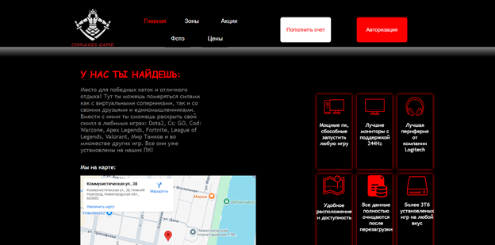
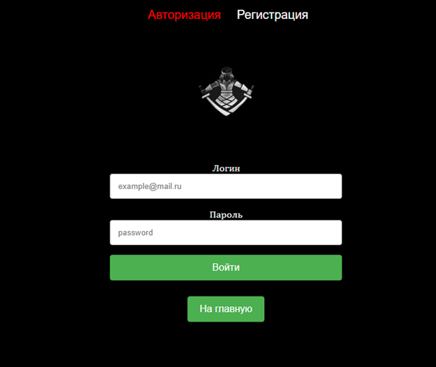

<h1 align="center"> Сайт по УП </h1>
<h2 align="center"> 


 


</h2>

> [!NOTE]  
> Некоммерческий сайт (результат работы на учебной практике)


## Преимущества нашего сайта для ПК клуба
- [x] Быстрый и удобный доступ
- [x] Понятный дизайн
- [x] Собственная база данных



## 

В проекте реализована собственная база данных, основанная на .xml файле. Она обеспечивает функции авторизации и регистрации пользователей на сайте
Также производилась работы с внедрением Яндекс.Карт



### Решение проблем
Сайт находится на стадии доработки, поэтому еще не выпущен в мировой хост. Посмотреть функционал можно клонировав репозиторий и запустить сайт через **localhost**
- <p style="text-align: left;"> Как открыть 
    <a href="https://strelokhalfer.github.io/mv-help/page/01_11_08.html">*localhost*</a> </p>
  
- <p style="text-align: left;"> Как склонировать репозиторий<br> 
 ```git init```<br>```git clone https://github.com/sedypana/site_pp.git```
</p>

### Авторы

<h3 align="center">


<h3>
